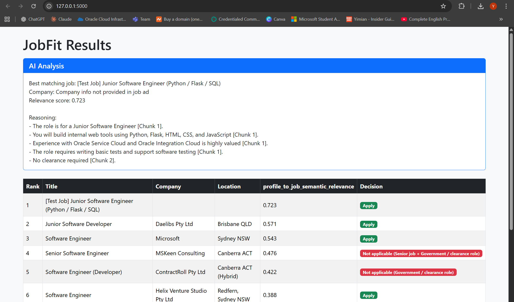

# JobFit – Vector-Based Job Matching with Retrieval-Augmented Generation

This project ranks job advertisements against a candidate profile using vector embeddings and similarity search. It applies basic rule-based filters (seniority level, work rights, and government or clearance keywords) to exclude roles that are not applicable.

For the top remaining job, the system retrieves the most relevant text chunks from the job description and passes them to a local language model (via Ollama). The model produces a chunk-cited explanation that shows which parts of the job description are relevant to the match. 

The project runs locally and uses:
- Vector similarity search for job matching
- Retrieval-Augmented Generation (retrieving relevant text chunks and feeding them to a local language model) 
- A simple web interface to display results

---

## Requirements

- Python
- Ollama (model used in the project: gemma3:4b)
- A `jobs.csv` file in the same folder as `jobfit.py`

---

## Install 

### 1) Create and activate a virtual environment
```powershell
python -m venv .venv
.\.venv\Scripts\activate
```
### 2) Install Python packages
`pip install pandas numpy faiss-cpu sentence-transformers flask ollama`

### 3) Install Ollama and download the model
1. Install Ollama
2. Download the model your code uses (eg, gemma3:4b)

---

## Run

From the project folder:
`python app.py`
Open in the browswer:
`http://127.0.0.1:5000`

## Running note 

This project is tested on Python 3.11.

If you are on Python 3.14 and you see NumPy import errors, use Python 3.11 for this project or run it inside a virtual environment created with Python 3.11. (eg, `python3.11 -m venv .venv`)

## Demo Screenshot



